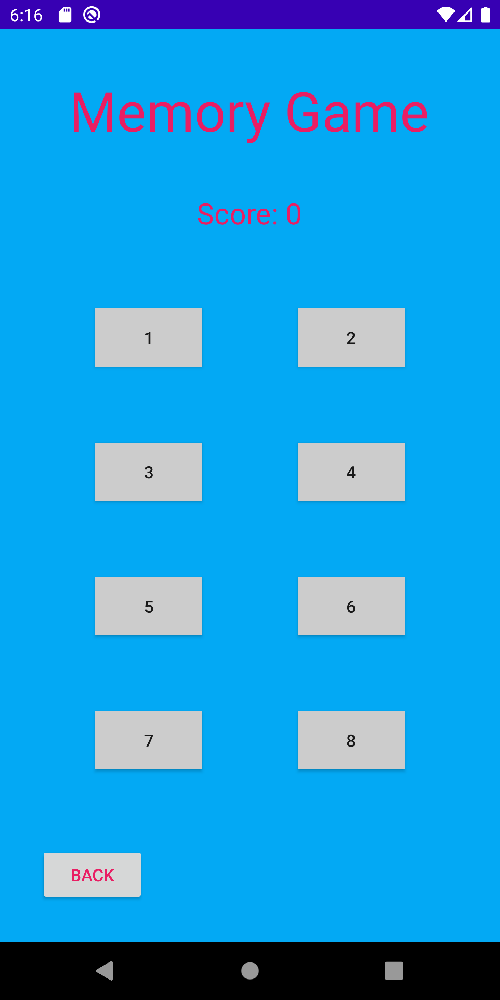

# Memory Game

Android hidden tile matching game written in Kotlin

### Challenges

- Creating a varied number of tiles based on difficulty
- Passing data between activities
- Programmatically laying out tiles using chains for an even layout independent of tile number

### Future Changes

- Added networking to sever using sockets
- Saving scores in a database using JDBC
- Improve advanced tile layout design for higher difficulties

### Screenshots

